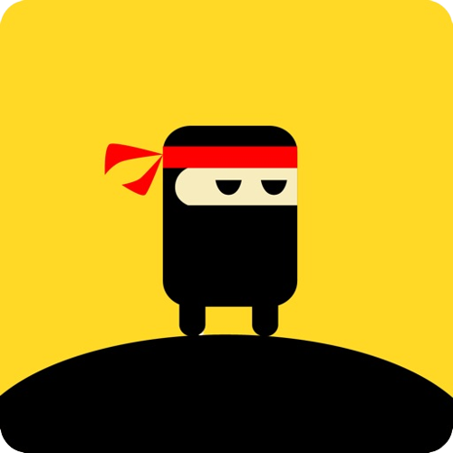

# Stick Ninja
- A simple canvas ninja game written in html5, css3 and javascript to have some fun in the boring time.
- This little game can run `online` same as `offline`

  

### 🔗Link: https://rededge967.github.io/stick-ninja/

## Running `Stick Ninja`
### Running `online`
- Open your browser
- go to https://rededge967.github.io/stick-ninja/

### Running `offline`
- Go to the [`releases`](https://github.com/RedEdge967/stick-ninja/releases) in this repo
- Download the latest version from there (download the `source code (zip)` file)
- Extract the folder
- Run `index.html` file in your browser

## How to play?
- First go to the game using one method shown in the up
- Then click the mouse to make a stick
- use the stick to get onto the other stages
- If your stick is too short or too long, you will lose the game

## Gameplay

https://user-images.githubusercontent.com/91379432/155825068-defa9420-344c-4d88-bae4-0962b039af8a.mp4

## Can I contribute?
- sure. open an issue, point out errors and what not? wanna fix something yourself? open a PR and I appreciate it.

> If this simple, little and fun game took you out of boring time, be sure to give this repo a star and a fork. all the pull requests for this project are welcomed.
